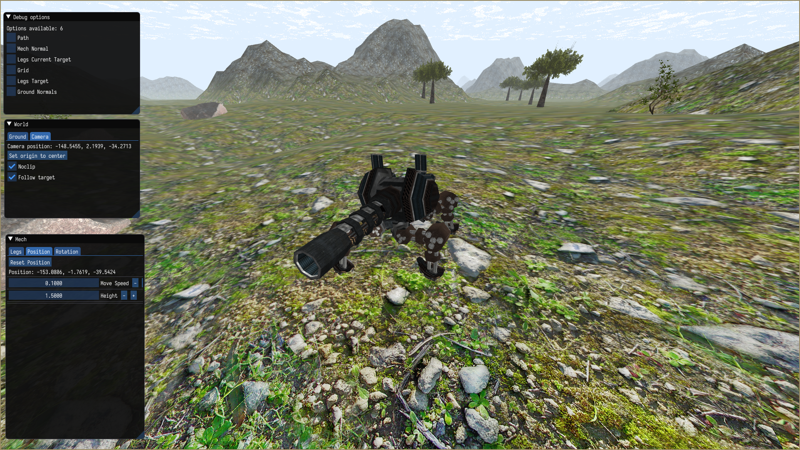
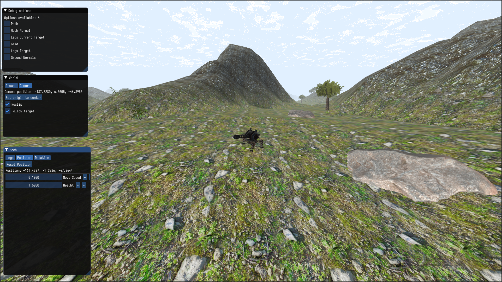

# MechIK Visualization

Inverse Kinematics Visualization of mechanical robot finding its way through procedurally generated world. Path finding is implemented via A* Algorithm. Terrain is generated from layers of Perlin noise. Terrain textures and scenery props are defined in INI configuration file. Parameters can also be controlled via UI. Terrain textures assignments can be dynamically changed.
Sky is procedural and generated in fragment shader.
To compile you need OpenGL library, GLEW and GLFW3. Correct version of my ZDLib engine should be placed in src/ directory. Your drivers should at least support OpenGL 3.3.


Installation steps:

```
$ mkdir build
$ cd build
$ cmake .. -DCMAKE_BUILD_TYPE=Release
$ make -j16
$ ./mech
```






